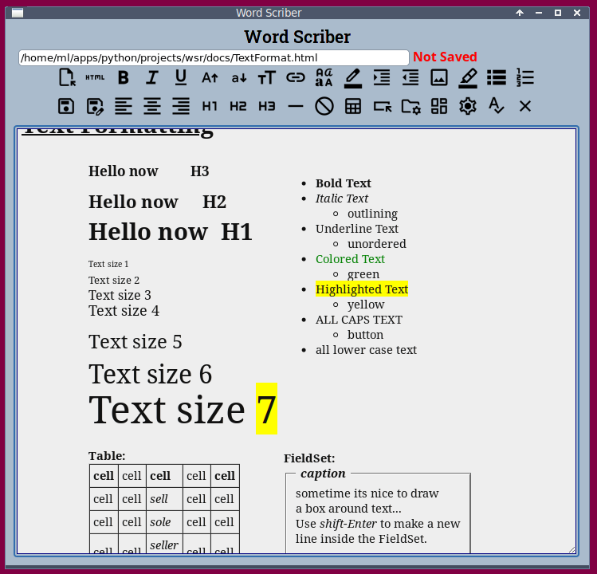

# wordScriber

__HTML local document editor__  
Windows version

This project demonstrates how to create apps that 
combine a python module (tkinter) and an HTML GUI 
in an offline desktop situation. In this case the 
focus is on using HTML to edit, create, and format
HTML documents. Here pywebview provides communication between
Python/tkinter and HTML/Javascript.

There are certain limitations depending on the web engine
and API employed. Web engines used outside of an Internet 
browser may be missing features found in the browser versions.
In the Windows version pywebview (_WebView2_) is provides HTML rendering.
In the Linux version pywebview uses _WebKitGTK_.

In the Windows version of this project pywebview
uses _WebView2_ (part of Edge). WebView2 supports
spell checking in a limited fashion. 

---

## How to install on Windows

__First install Python:__  
-	from command prompt: winget install Python (winget may not work)  
-	or from Internet _https://www.python.org/downloads/_
-	or from MS Store "python"  

__from command prompt:__
- `pip install pywebview`

__Install the Edge runtime__
-	MicrosoftEdgeWebView2RuntimeInstallerX64.exe

__Lastly run:__
-	Setup_wsr.exe
- or clone this repository

---

The purpose of this project is to demonstrate how the pywebview module 
provides communication between Python/tkinter and HTML/Javascript.

